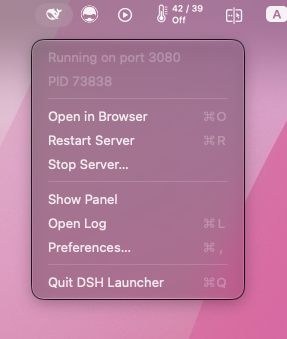
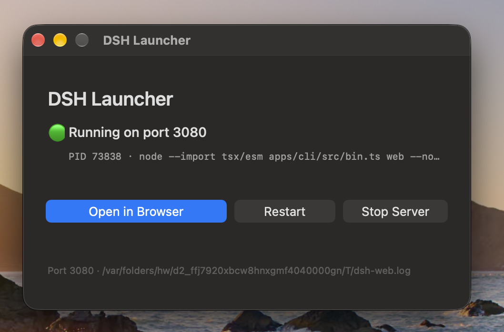

# DSH Launcher

> **English** · [简体中文](README.zh-CN.md)

> [!IMPORTANT]
> **Arrived from the plugin market? This plugin belongs to a macOS app.**
> On its own it only writes a small JSON file describing the running server —
> that is deliberate, and it is all it does. The thing you actually interact
> with is a **macOS menu bar app**, built from this repository with
> `./build.sh`. Install the app first; see [Install](#install).
> Not on macOS? The plugin runs anywhere, but nothing here will be useful to
> you without the app.

A tiny macOS **menu bar** utility for a local development server: start it,
open it in your browser, restart it, or stop it — without touching a terminal.

It lives in the status bar with no Dock icon, so it stays out of your way.

Written for [DeepSeek Harness](https://github.com/deepseek-ai/deepseek-harness)
(`pnpm dsh web`), but the command, port, project folder and browser are all
configurable, so it works for any long-running local server.

Native AppKit, single Swift file, **no dependencies**.

It ships with a small companion **DSH plugin** so the app learns the server's
port, PID and tokenized URL from the server itself rather than by reading its
log. See [DSH plugin](#dsh-plugin).


https://github.com/user-attachments/assets/153503d2-c5b8-4d74-aaff-aa20f18bf6de


## Why I built this

The itch was simple: every time I wanted to use
[DeepSeek Harness](https://github.com/deepseek-ai/deepseek-harness), running it
from source meant running it from a terminal.

```sh
cd ~/Workspace/deepseek-harness
pnpm dsh web
```

The command itself is small — but the ceremony around it wasn't. The terminal
tab had to stay open for the whole session; pulling new changes meant going
back to it, killing the server, and starting it again; the URL with its
per-process token had to be copied out of the logs; and when the session was
over the server had to be stopped by hand or it kept squatting on the port.

All the actual work happens in a browser tab. The terminal was never the point
of the tool — it was just the tollbooth in front of it. So I gave that ceremony
a menu bar icon instead: one click to start, one click to open the browser,
restart after an update, and a confirmed stop — with the server's state visible
at a glance and no Dock icon in the way.

Trying to do this *properly* from a GUI app is also what surfaced the sharp
edges that the terminal had been silently papering over — a GUI app inherits no
shell `PATH`, DSH's launch token must survive into the opened tab, and stopping
must target only the process listening on the port. Those are documented under
[How it works](#how-it-works).

## Menu bar

The status icon is the DeepSeek whale, drawn as a template image so macOS
tints it for light and dark menu bars. It shows server state at a glance —
**solid** when running, **dimmed** when stopped — and everything is one click
away:

<p align="center">
  
</p>

The two dimmed lines at the top are status, not actions: server state
(**Running on port 3080**, **Not running**, or a transient **Starting…** /
**Stopping…**) and the PID.

When the server is stopped, the menu shows **Start Server** instead.

State is polled every 3 seconds, so the icon stays correct even when you start
or stop the server from a terminal.

## Panel (optional)

**Show Panel** opens a small window with the same actions:

<p align="center">
  
</p>

Closing the panel does **not** quit the app — it stays in the menu bar.

Note the window controls: close and minimize are enabled, while
zoom/fullscreen is deliberately greyed out — this is a fixed-size panel, and
stretching it full-screen would only add empty space.

## Install

This repository ships **two independent pieces**, and it is worth being clear
about which is which:

| Piece | What it is | Installed by | Required? |
|---|---|---|---|
| **The app** | a macOS menu bar app | `./build.sh` | **yes** — it is the launcher |
| **The plugin** | a DSH plugin (`dsh-menubar-launcher`) | `dsh plugin add` | no — recommended |

The app is the product. The plugin is a small helper that runs inside the
server and tells the app the URL to open. **The app works without it**; see
[Do I need the plugin?](#do-i-need-the-plugin) for exactly what changes.

### 1. Install the app

Requires macOS 13+ and the Xcode Command Line Tools (`xcode-select --install`).

```sh
git clone https://github.com/songer522/dsh-launcher.git
cd dsh-launcher
./build.sh
```

That compiles, bundles, signs, and installs to `/Applications`. Launch it from
there — it appears in the menu bar, with no Dock icon.

```sh
./build.sh --dev        # build into ./build without installing
./build.sh --uninstall  # remove the installed app
```

### 2. Install the plugin (recommended)

```sh
dsh plugin --profile web add https://github.com/songer522/dsh-launcher/releases/latest/download/dsh-menubar-launcher.tgz
```

**Then restart the server** — from the app's **Restart** menu item, or by
stopping and starting it however you normally do. A plugin is composed when the
server starts, so a server that was already running does not have it, and
nothing will appear until it restarts.

Verify it took effect:

```sh
cat ~/.config/dsh-launcher/runtime.json
```

A JSON object means it is working. "No such file or directory" means either the
server has not been restarted since installing, or it is not running.

The plugin also appears under **Settings → Plugins** in the DSH web UI, as
`dsh-menubar-launcher` with a green *active* dot.

> **Use the same profile the app launches.** The command above installs into the
> `web` profile, which is what `dsh web` and the app's default command
> (`pnpm dsh web …`) both boot. If you changed the app's **command** in
> Preferences to use a different profile, pass that profile to
> `dsh plugin --profile <name> add …` instead, or the server the app starts will
> not have the plugin.

To remove it: `dsh plugin --profile web remove dsh-menubar-launcher`.

### Do I need the plugin?

No. The app has always resolved DSH's per-process token by reading the log of
the server **it started**, and that still works. The plugin matters in the case
that mechanism cannot cover — a server the app did **not** start:

| Situation | Without the plugin | With the plugin |
|---|---|---|
| You start the server from the app | ✅ works (reads its log) | ✅ works |
| The server was started from a terminal | ❌ opens a tab that 401s | ✅ works |
| The server was started before the app | ❌ opens a tab that 401s | ✅ works |

So: install the app alone if you always start the server from the app. Add the
plugin if you also run `dsh web` from a terminal, or leave a server running
across app restarts.

Both paths are kept deliberately — the plugin is an improvement, not a
requirement, and the app never assumes it is there.

## Configuration

On first run the app looks for a DeepSeek Harness checkout in the usual places
(`~/Workspace`, `~/Projects`, `~/Developer`, `~/src`, `~/code`, `~`). If your
project lives elsewhere, or you want to launch something entirely different,
open **Preferences** (⌘,).

Settings are stored as JSON at `~/.config/dsh-launcher/config.json`:

```json
{
  "repo": "/Users/you/Workspace/deepseek-harness",
  "command": "pnpm dsh web --no-open --port {port}",
  "port": "3080",
  "browser": "Google Chrome",
  "logFile": "/tmp/dsh-web.log",
  "language": "system"
}
```

| Field | Meaning |
|---|---|
| `repo` | working directory the command runs in |
| `command` | the launch command; `{port}` is substituted |
| `port` | the port to watch, and to substitute into the command |
| `browser` | app name to open, or `""` for the system default |
| `logFile` | where the server's stdout/stderr is written |
| `language` | interface language: `system`, `en`, or `zh-Hans` |

Because it is just a command in a directory, it happily runs `npm run dev`,
`vite`, `python -m http.server`, or anything else.

### Language

The interface is available in **English** and **简体中文**. Choose one under
**Preferences (⌘,) → Language**; it applies immediately, with no relaunch.

The default, **System**, follows macOS — Chinese when your preferred language
is Chinese, English otherwise. The explicit choices exist because running one
app in a different language from the rest of the system is common enough among
developers to be worth a setting.

### Why a launch flag matters

The stock command uses `--no-open` because DSH otherwise opens the URL in the
**system default browser**. Suppressing that and opening the browser here is
what lets you use Chrome while Safari remains your system default.

## DSH plugin

The app can manage a server it did not start — but then it has no log to read,
and DSH's per-process token lives only in that log. The result was a menu item
that opened a tab answering 401.

This repository therefore also ships a Host plugin. It runs *inside* the
harness, where the port and the token are not parsed but simply known, and
writes them where the app can find them. [Install it](#2-install-the-plugin-recommended)
with `dsh plugin add`; installing from source instead of the release tarball
works too, and needs no build step either:

```sh
dsh plugin --profile web add github:songer522/dsh-launcher
```

Once the server restarts, it writes `~/.config/dsh-launcher/runtime.json`:

```json
{
  "version": 1,
  "pid": 29185,
  "host": "127.0.0.1",
  "port": 3396,
  "url": "http://127.0.0.1:3396",
  "authenticatedUrl": "http://127.0.0.1:3396/?token=…",
  "startedAt": "2026-09-08T21:51:36.643Z"
}
```

The file is created once the server is listening and **removed when it stops**,
so its presence is itself a liveness signal. It is written `0600`, and the
directory `0700`: `authenticatedUrl` contains a launch token, which is a
credential granting full access to that harness. Treat it like one.

The app prefers this file and falls back to log parsing when it is absent, so
the plugin is optional — without it you get exactly the previous behaviour.
A descriptor is used only when the PID it names is the process currently
listening on the port, so a file left behind by a `kill -9` is ignored rather
than used to open a dead tab.

The plugin is not macOS-specific: anything that wants the authenticated URL of
a running harness can read the same file.

To move it, restate the row's whole config in your profile's
`cordis.patch.yml` (a patch replaces a row's config rather than merging into
it) — note that the app looks only at the default path:

```yaml
- id: dsh-launcher-runtime
  config:
    path: /somewhere/else/runtime.json
    enabled: true
```

The plugin declares no dependencies at all, so it installs against any harness
version and needs no `allowBuilds` approval. In a profile without a web server
— `headless`, say — it simply does nothing and the harness boots normally.

## Window behaviour

The app is a menu bar utility (`LSUIElement`), so it has **no Dock icon** and no
⌘Tab entry. Quit it from the menu bar.

For the optional panel:

| Control | State |
|---|---|
| Close (red) | enabled — hides the panel; app stays in the menu bar |
| Minimize (yellow) | enabled |
| Zoom / fullscreen (green) | disabled — fixed-size panel |

Fullscreen is suppressed both by omitting `.resizable` from the window's
`styleMask` and by adding `.fullScreenNone` to its `collectionBehavior`, so
⌃⌘F does nothing either.

The server is started **detached**, so quitting the launcher never stops it.
Stopping is always an explicit, confirmed action — the server may be hosting
live sessions.

## How it works

Four details that are easy to get wrong:

**1. GUI apps have no shell PATH.** A double-clicked app does not read
`~/.zshrc` and does not inherit a login `PATH`, so `pnpm` would simply not be
found. Binaries are resolved explicitly against common install locations, with
a login-shell lookup as a fallback. The spawned server also gets those
directories prepended to its `PATH`: resolving `pnpm` alone is not enough,
because it execs `node`, which would otherwise fail with
`env: node: No such file or directory`.

**2. Authentication tokens must be carried over.** DSH mints a per-process
launch token and prints the URL with it; the bare origin answers HTTP 401, so
the tab would be dead. The app resolves that URL from two sources, in order:
the [runtime descriptor](#dsh-plugin) written by the companion plugin, then the
log this run printed. The descriptor is preferred because it is also correct
for a server started from a terminal — the case where there is no log to read.
Servers that publish neither fall back to the plain URL.

**3. Port probing must filter for listeners.** This app uses:

```sh
lsof -ti tcp:3080 -sTCP:LISTEN
```

Without `-sTCP:LISTEN`, `lsof` also reports every *client* connected to that
port — your browser, your editor — and acting on those PIDs would terminate
unrelated applications. Only one process can hold `LISTEN` on a port, so this
targets exactly the server no matter what its PID happens to be.

**4. Stopping is graceful.** `TERM` first, escalating to `KILL` only if the port
is still bound after ~6 seconds.

## Development

Everything lives in one file: `Sources/DSHLauncher.swift`.

```sh
swiftc -O Sources/DSHLauncher.swift -o build/DSHLauncher && ./build/DSHLauncher
```

### The code-signing gotcha

Nothing to do here if you are just installing — `build.sh` already gets this
right, and verifies the signature before it finishes. It matters only if you
edit the build script, so the reason the step order cannot be rearranged is
written down.

`build.sh` signs the bundle **last**, and that ordering is not cosmetic.
Modifying a bundle after signing — replacing the icon, editing `Info.plist` —
invalidates the signature, and macOS then refuses to treat the directory as an
application. The visible symptom is that **Finder shows a folder icon**, which
looks like an icon bug but is really a signature failure:

```
$ codesign -v "/Applications/DSH Launcher.app"
invalid Info.plist (plist or signature have been modified)
```

To see the icon macOS actually resolves, bypassing Finder's cache:

```sh
osascript -l JavaScript -e 'ObjC.import("AppKit");
var img=$.NSWorkspace.sharedWorkspace.iconForFile("/Applications/DSH Launcher.app");
var rep=$.NSBitmapImageRep.imageRepWithData(img.TIFFRepresentation);
rep.representationUsingTypeProperties($.NSPNGFileType,$()).writeToFileAtomically("/tmp/resolved.png",true);'
open /tmp/resolved.png
```

## Shell equivalents

If you prefer the terminal, these do the same jobs. Two details matter: the
`-sTCP:LISTEN` filter, and capturing the tokenized URL instead of opening the
bare origin (which answers 401).

```sh
dshweb() {
  local port="${DSH_WEB_PORT:-3080}"
  local log="${TMPDIR:-/tmp}/dsh-web-${port}.log"
  : > "$log"   # a stale URL carries a dead token
  (cd ~/Workspace/deepseek-harness && pnpm dsh web --no-open --port "$port" > "$log" 2>&1) &
  local server=$!
  tail -f "$log" & local tailer=$!

  while ! nc -z 127.0.0.1 "$port" 2>/dev/null; do
    kill -0 "$server" 2>/dev/null || { kill "$tailer" 2>/dev/null; return 1; }
    sleep 0.3
  done

  # DSH prints `dsh web: http://127.0.0.1:PORT/?token=…` — open that, not the
  # bare origin. Prefer loopback and exclude brackets: the LAN URL is printed
  # on the same line inside parentheses.
  local url=""
  for _ in {1..40}; do
    url=$(grep -aoE "https?://[^[:space:]'\"()]*[?&]token=[^[:space:]'\"()]+" "$log" \
          | grep -E "127\.0\.0\.1|localhost" | tail -1)
    [ -n "$url" ] && break
    sleep 0.25
  done

  open -a "Google Chrome" "${url:-http://127.0.0.1:$port}"
  wait "$server"; kill "$tailer" 2>/dev/null
}

dshkill() { lsof -ti tcp:3080 -sTCP:LISTEN | xargs kill; }
```

Note that in zsh a background *pipeline* (`cmd | tee log &`) sets `$!` to `tee`
rather than the server, which breaks the liveness check — hence redirecting to a
log and tailing it separately.

Beware also that `lsof -ti tcp:PORT` **without** `-sTCP:LISTEN` matches clients
connected to the port too, so that widely-shared one-liner can kill your browser.

## License

[MIT](LICENSE)
